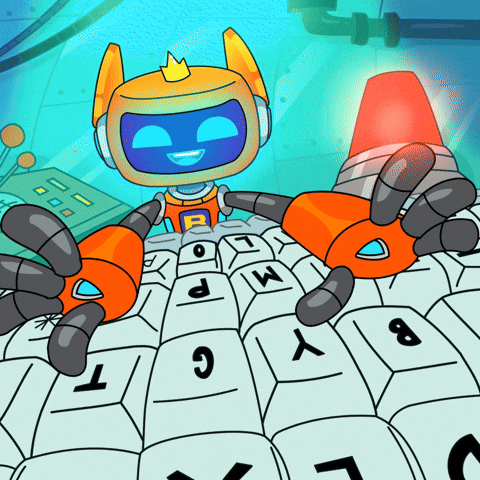
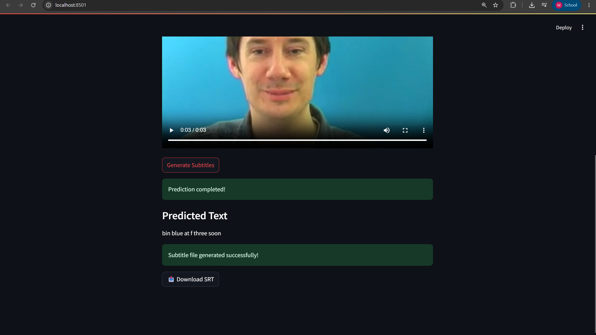

## 👋 Hi there, I'm Mugilan 

  

## 👨‍💻 About Me

Aspiring AI Engineer and AI Enthusiast passionate about building intelligent applications using Generative AI, Machine Learning, Computer Vision, and Python.

Currently exploring LLMs, RAG, AI Agents, DSA, and real-world AI projects.

🎓 B.Tech Artificial Intelligence & Data Science Student at

**Agni College of Technology**

 

## 🌐 Connect With Me

##

### 🛠️ Tech Stack

  
  
  
  
  
  
  
  
  

  

### 💻 Skills

  

##
   

## 🚀 Featured Project

### 🎯 AI Lip Reader

AI-powered lip reading system that converts silent videos into text transcripts and downloadable SRT subtitle files.

**Tech Stack:** PyTorch, OpenCV, MediaPipe, Streamlit

### Key Highlights

* Trained on ~33,000 GRID Corpus samples
* Automatic lip detection and extraction
* Deep learning-based speech prediction
* Subtitle (.srt) generation
* Interactive Streamlit web application

🔗 **Repository:**
[AI Lip Reader Repository](https://github.com/mugilansGIT/AI-Lip-Reader)

🎥 **Demo:**
[Watch Demo Video](https://drive.google.com/file/d/1yTKMR-n57uhGuUfvYZJBQRt0HNGkx8q4/view?usp=sharing)

---
   

## 🏆 Achievements

* 🥇 Winner – Cybertrix 2025, St. Joseph's Institute of Technology
* 🥇 Winner – Invente 2025, Shiv Nadar University
* 🥇 Winner – Mind Spark X, Sriram Engineering College
* 🥇 Winner – Borderland Decrypt, Meenakshi Sundararajan Engineering College
* 🥇 Winner – Craftathon Hackathon, Gandhinagar University

---

## 📜 Certifications

* 🎓 Data Science & Machine Learning Internship Certification – YBI Foundation
* 🎓 Elite Certificate – Software Testing, NPTEL

---
   

## 📊 GitHub Statistics

 

---

## ♟️ Fun Fact

Chess is one of my favorite hobbies. I enjoy exploring openings, solving puzzles, and improving my tactical play. The strategic thinking required in chess has helped me develop a more analytical approach to coding, machine learning, and problem-solving.
